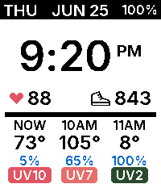
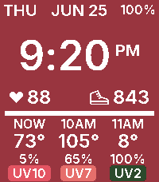
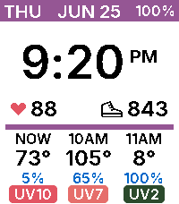
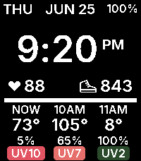
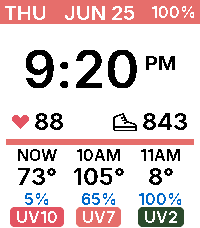
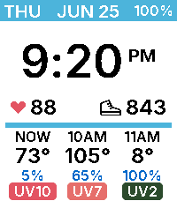
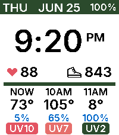

# WeatherSoon

<p align="center">
  &nbsp;&nbsp;&nbsp;&nbsp;
  &nbsp;&nbsp;&nbsp;&nbsp;
  &nbsp;&nbsp;&nbsp;&nbsp;
  &nbsp;&nbsp;&nbsp;&nbsp;
  &nbsp;&nbsp;&nbsp;&nbsp;
  &nbsp;&nbsp;&nbsp;&nbsp;
  
</p>

WeatherSoon is a Pebble Time 2 watchface based on Andrew Ford's Percival. This fork keeps the crisp, configurable accent-color spirit, but changes the face into a compact near-term weather dashboard for modern Rebble/Pebble use.

## What Changed From Percival

- Rebuilt the main layout around Pebble Time 2 / `emery`, with a large center clock and dense status rows.
- Replaced the original configurable complication grid with a fixed glanceable dashboard:
  - top row: weekday, date, battery, and connection/quiet-time flags
  - middle row: heart rate and step count
  - bottom row: current hour plus the next two hours
- Added hourly weather from Open-Meteo:
  - temperature
  - precipitation probability
  - UV index with color-coded badges
- Added a Clay settings page for:
  - accent color
  - Paper vs Ink canvas mode
  - Fahrenheit vs Celsius
- Swapped the old complication screenshot set for screenshots of the current UI in every supported accent color.
- Added custom low-resolution drawing for the heart-rate icon and tighter Time 2 visual spacing.

The original Percival app listing is here:
https://apps.repebble.com/2799cd581c2a4bbbade7f3da

## Features

- Pebble SDK 3 native watchface targeting `emery`
- Live hourly forecast using phone geolocation and Open-Meteo
- Weather cache in persistent storage so the face still has data after reloads
- Configurable accent color and canvas mode
- Health-service heart rate and step count
- Color-coded semantic data:
  - red heart rate icon
  - blue precipitation percentages
  - green/orange/red UV risk badges

## Build

```sh
pebble build
pebble install --emulator emery
```

For WSLg on this machine, the emulator needs software OpenGL:

```sh
LIBGL_ALWAYS_SOFTWARE=1 pebble install --emulator emery
LIBGL_ALWAYS_SOFTWARE=1 pebble screenshot --emulator emery --no-open screenshots/weathersoon-latest.png
```

Run `pebble clean` after adding or removing message keys in `package.json`; generated Pebble headers can otherwise go stale.

## Screenshots

The checked-in screenshots are demo captures, generated from `DEMO_MODE` data in [src/c/main.c](src/c/main.c). Normal builds should keep:

```c
#define DEMO_MODE 0
```

To regenerate the gallery, temporarily set `DEMO_MODE` to `1`, build and install once, then send `PrimaryColor` and `Canvas` settings to the emulator before each screenshot.

## Project Structure

- [src/c/main.c](src/c/main.c): watchface UI, settings, persistent weather cache, health data, and AppMessage handling
- [src/pkjs/index.js](src/pkjs/index.js): PebbleKit JS geolocation and Open-Meteo hourly forecast fetch
- [src/pkjs/config.js](src/pkjs/config.js): Clay settings page
- [package.json](package.json): Pebble metadata, message keys, fonts, and image resources
- [screenshots/](screenshots): README/demo captures for each supported accent color
